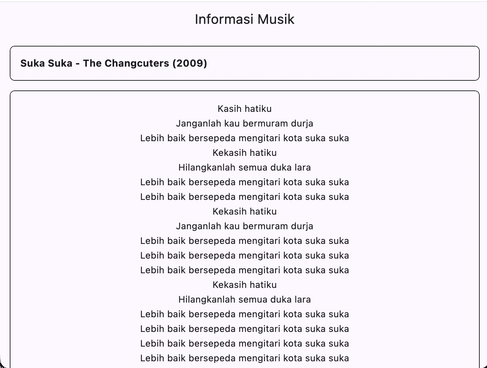
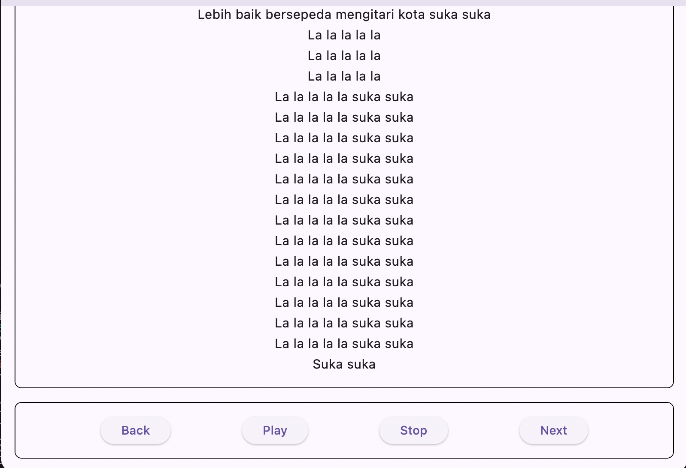

# Laporan Praktikum - Week 2: Pengenalan Dart & Widget Dasar Flutter

**Data Mahasiswa:**
- **Nama:** Aldi Surya Saputra
- **NIM:** 244107020184
- **Mata Kuliah:** Pemrograman Mobile

---

## 📌 Deskripsi Program

Pada praktikum Week 2 ini, dibuat sebuah aplikasi Flutter untuk menampilkan informasi musik beserta lirik lagu dan tombol kontrol navigasi audio sederhana. Program ini menerapkan konsep **Object-Oriented Programming (OOP)** pada Dart serta penggunaan widget-widget dasar Flutter untuk menyusun tampilan antarmuka (UI).

---

## 📂 Struktur File dan Penjelasan Kode

### 1. `lib/Lirik.dart`
Berisi class `Lirik` yang menyimpan teks/bait lirik lagu dan method `tampilkanLirik()` untuk mencetak lirik ke konsol.

```dart
class Lirik {
  String bait;

  Lirik({
    this.bait = '''Kasih hatiku
Janganlah kau bermuram durja
...''',
  });

  void tampilkanLirik() {
    print('Lirik:\n$bait');
  }
}
```

### 2. `lib/Musik.dart`
Berisi class `Musik` yang memiliki atribut `judul`, `artis`, `tahun`, dan relasi objek `lirik` bertipe class `Lirik`. Memiliki method `tampilkanInfo()` untuk menampilkan informasi lagu.

```dart
import 'Lirik.dart';

class Musik {
  String judul;
  String artis;
  int tahun;
  Lirik lirik;

  Musik({
    required this.judul,
    required this.artis,
    required this.tahun,
    required this.lirik,
  });

  void tampilkanInfo() {
    print('Judul: $judul');
    print('Artis: $artis');
    print('Tahun: $tahun');
    lirik.tampilkanLirik();
  }
}
```

### 3. `lib/Mhs.dart`
Berisi class `Mhs` untuk menyimpan data mahasiswa (`name`, `kelas`, `umur`) beserta method `tampilkanInfo()`.

```dart
class Mhs {
  String name;
  String kelas;
  int umur;

  Mhs({
    required this.name, 
    required this.kelas, 
    required this.umur,
  });

  void tampilkanInfo() {
    print('Nama: $name');
    print('Kelas: $kelas');
    print('Umur: $umur');
  }
}
```


---

## 📸 Hasil dan Dokumentasi (Screenshot)

Berikut adalah tampilan antarmuka aplikasi Flutter yang dijalankan:

### 1. Tampilan Atas (Info Lagu & Sebagian Lirik)
Menampilkan AppBar, Container Info Lagu (*Suka Suka - The Changcuters (2009)*), dan bagian awal lirik lagu.



---

### 2. Tampilan Bawah (Lanjutan Lirik & Tombol Kontrol Musik)
Menampilkan sisa lirik lagu setelah di-scroll beserta Container Tombol (*Back, Play, Stop, Next*).


